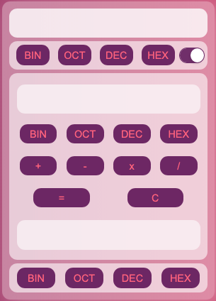

*(Update - BaseTransformer repository - C++) Now with Interface and bugs corrections.

#  Base Calculator

##  Why did I create?
This is a software created to help students who are starting in the area of ​​programming and mathematical logic as well as beginning programmers.

This initiative was created after a personal analysis of the need for this tool in my college class, so I created it for assistance.

#  Tools

- Java Language;
- Swing Library;
- Translation methods;
- Netbeans IDE.

# Screenshots

       
